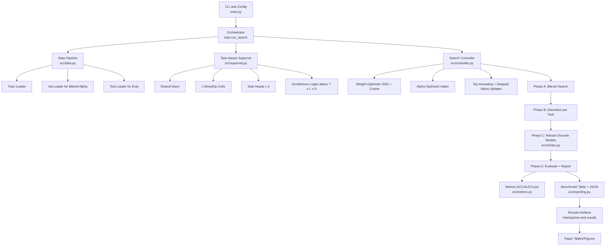
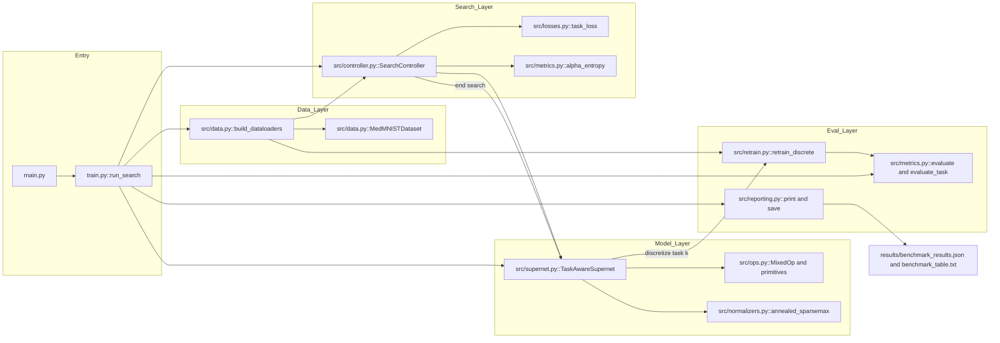
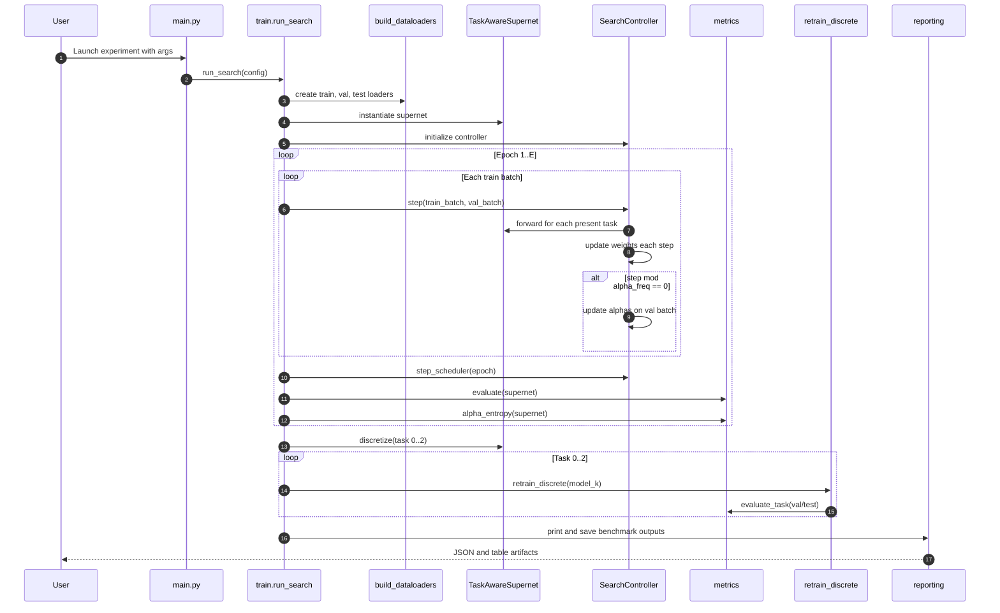
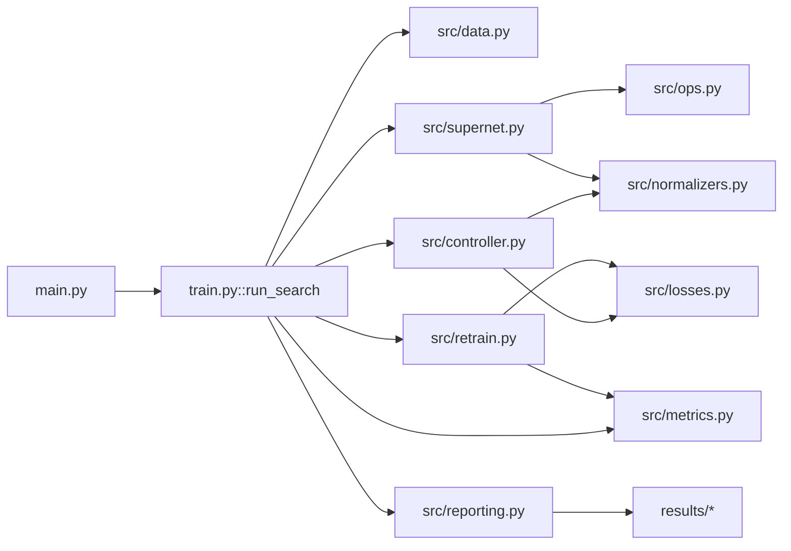

# MT-DARTS v2 Architecture (Conference-Ready Technical Note)

## 1. Scope and Positioning

This document specifies the architecture, optimization pipeline, and experimental protocol of MT-DARTS v2 for multi-task neural architecture search (NAS) on MedMNIST.

Target use: method section and supplementary material for top-tier venues (CVPR/NeurIPS/AAAI) with emphasis on:
- clear problem formulation,
- implementation-faithful design description,
- reproducibility and ablation readiness,
- explicit mapping between equations and source code.

Codebase entry points:
- [main.py](main.py)
- [train.py](train.py)
- [src/supernet.py](src/supernet.py)
- [src/controller.py](src/controller.py)
- [src/data.py](src/data.py)
- [src/retrain.py](src/retrain.py)

---

## 2. Problem Setup

We search task-specific architectures jointly for three medical image tasks:
- Task 0: PathMNIST (single-label, 9 classes)
- Task 1: ChestMNIST (multi-label, 14 classes)
- Task 2: DermaMNIST (single-label, 7 classes)

A shared supernet provides feature extraction, while each task has:
- its own classification head,
- its own architecture parameters over operation choices at each searchable layer.

Goal:
learn high-performing, compact per-task discrete architectures with a single differentiable search pass, then retrain each selected architecture from scratch.

---

## 3. High-Level System Architecture

Pipeline stages (implemented in [train.py](train.py)):
1. Phase A - Bilevel architecture search on supernet.
2. Phase B - Discretize each task architecture via argmax over searched operation logits.
3. Phase C - Retrain each discrete model from random initialization.
4. Phase D - Evaluate and report benchmark metrics.

Conceptual forward graph:

Input (B,3,28,28)
-> shared stem
-> L searchable cells (MixedOp)
-> task-specific head k
-> task-specific loss

Where each MixedOp is a weighted sum over candidate primitives.

---

## 4. Search Space and Supernet Design

### 4.1 Candidate operations per searchable layer

Defined in [src/ops.py](src/ops.py):
- MBConv3x3
- MBConv5x5
- DilatedConv3x3
- SkipConnect
- Zero

Let the number of operations be $O=5$ and layers be $L$.

### 4.2 Supernet parameterization

The supernet in [src/supernet.py](src/supernet.py) contains:
- shared stem,
- $L$ MixedOp cells,
- one task head per task,
- architecture logits $\alpha \in \mathbb{R}^{T \times L \times O}$.

For task $t$, layer $\ell$, the normalized op weights are:

$$
\pi_{t,\ell} = \operatorname{Sparsemax}\!\left(\frac{\alpha_{t,\ell}}{\tau}\right),
$$

with temperature $\tau$ annealed during search.

Layer output:

$$
\mathbf{h}_{\ell+1} = \sum_{o=1}^{O} \pi_{t,\ell,o} \cdot o(\mathbf{h}_{\ell}).
$$

Key property:
architecture parameters are task-indexed; gradients of task $t$ losses update only $\alpha_t$, enabling task-level architecture disentanglement.

---

## 5. Data and Task Routing

Implemented in [src/data.py](src/data.py):
- unified dataset merging PathMNIST, ChestMNIST, DermaMNIST,
- mixed-task mini-batches with task IDs,
- custom collation for heterogeneous labels,
- real MedMNIST loading with synthetic fallback.

Label formats:
- single-label tasks: scalar class index,
- multi-label ChestMNIST: multi-hot vector of size 14.

Loss dispatch in [src/losses.py](src/losses.py):
- CrossEntropy for single-label tasks,
- BCEWithLogits for ChestMNIST.

---

## 6. Optimization: Bilevel Search Controller

Implemented in [src/controller.py](src/controller.py).

At each step, the controller performs:
1. Weight update on training batch (architecture frozen).
2. Architecture update on validation batch every $f$ steps (delayed alpha updates).

Formally:

$$
\mathbf{w} \leftarrow \mathbf{w} - \eta_w \nabla_{\mathbf{w}} \mathcal{L}_{train}(\mathbf{w},\alpha)
$$

$$
\alpha \leftarrow \alpha - \eta_{\alpha} \nabla_{\alpha} \mathcal{L}_{val}(\mathbf{w},\alpha), \quad \text{only if step} \bmod f = 0.
$$

Learning-rate schedule:
- SGD with cosine annealing for network weights.

Temperature schedule:

$$
\tau_e = \max\left(\tau_0 \cdot a^{\lfloor e/m \rfloor},\; 10^{-2}\right),
$$

where:
- $\tau_0$: initial temperature,
- $a$: anneal factor,
- $m$: anneal interval in epochs,
- $e$: current epoch.

### Early stopping criterion

Entropy-based convergence in [src/metrics.py](src/metrics.py):

$$
H = -\frac{1}{TL}\sum_{t=1}^{T}\sum_{\ell=1}^{L}\sum_{o=1}^{O}
\pi_{t,\ell,o}\log\pi_{t,\ell,o}.
$$

Search stops early if $H < \epsilon$ (configurable entropy threshold).

---

## 7. Discretization and Retraining Protocol

### 7.1 Discretization

For each task $t$, choose operation index:

$$
\hat{o}_{t,\ell} = \arg\max_{o} \alpha_{t,\ell,o}
$$

and instantiate a discrete sequential model (see [src/supernet.py](src/supernet.py)).

### 7.2 Retraining

Implemented in [src/retrain.py](src/retrain.py):
- reinitialize all weights,
- train with SGD + cosine annealing,
- keep best checkpoint by validation AUC,
- report test ACC/AUC/loss.

This follows standard DARTS evaluation convention: search and retrain are separated.

---

## 8. Metrics and Reporting

Evaluation logic in [src/metrics.py](src/metrics.py):
- per-task ACC,
- per-task AUC (with multi-label-safe handling and graceful fallback when AUC is undefined),
- per-task loss.

Final artifacts from [src/reporting.py](src/reporting.py):
- ASCII benchmark table,
- JSON summary including per-task architecture and macro averages.

---

## 9. Code-to-Method Mapping (for Paper Writing)

Use this mapping to keep manuscript claims implementation-faithful:

- Method overview and CLI hyperparameters:
  [main.py](main.py)
- End-to-end experimental protocol (Phases A-D):
  [train.py](train.py)
- Supernet and task-specific architecture parameters:
  [src/supernet.py](src/supernet.py)
- Bilevel optimization, delayed alpha updates, temperature annealing:
  [src/controller.py](src/controller.py)
- Sparsemax and annealed sparsemax equations:
  [src/normalizers.py](src/normalizers.py)
- Search space primitives and MixedOp composition:
  [src/ops.py](src/ops.py)
- Data unification and task-aware label handling:
  [src/data.py](src/data.py)
- Task-aware losses:
  [src/losses.py](src/losses.py)
- Evaluation metrics and entropy stopping:
  [src/metrics.py](src/metrics.py)
- Retrain-from-scratch protocol:
  [src/retrain.py](src/retrain.py)

---

## 10. Reproducibility Checklist (Top-Tier Ready)

For CVPR/NeurIPS/AAAI quality, include all items below in experiments:

1. Determinism and seeds
- Report all seeds.
- Keep code-level seed setting enabled.
- Document nondeterministic ops if any backend uses them.

2. Data protocol
- Report exact split sizes for train/val/test for each MedMNIST task.
- State preprocessing and normalization constants.
- Clarify whether downloaded cached files or online loading were used.

3. Compute budget
- Report device type (CPU/CUDA/MPS), memory, and wall-clock search/retrain time.
- Report trainable parameter counts for supernet and discrete models.

4. Hyperparameters
- Publish full search and retrain hyperparameter tables:
  learning rates, batch size, layers, channels, tau schedule, alpha update frequency, entropy threshold.

5. Statistical reliability
- Run multiple seeds (recommended 3 to 5).
- Report mean and standard deviation for AUC/ACC.

6. Fair comparison
- Keep identical data splits and evaluation metrics across baselines.
- Match or report parameter/FLOP budgets where possible.

7. Artifacts
- Save checkpoints and benchmark JSON outputs.
- Version-control environment and dependency versions.

---

## 11. Recommended Ablations for Strong Submission

Minimum ablations to justify novelty:

1. Sparsemax vs softmax in architecture weighting.
2. Temperature annealing on/off and different anneal factors.
3. Delayed alpha updates frequency sweep (e.g., 1, 5, 10, 20).
4. Entropy-based early stopping on/off and threshold sweep.
5. Search-space ablation (remove Zero, remove DilatedConv, etc.).
6. Shared vs task-specific architecture parameters.

Report both performance and efficiency (search time, retrain time, params).

---

## 12. Known Implementation Notes

1. Mixed-task data loader is used throughout the pipeline with task-aware filtering during evaluation and bilevel losses.
2. ChestMNIST images may be loaded as grayscale tensors and are converted to 3 channels in [src/data.py](src/data.py), ensuring a consistent 3-channel input interface.
3. AUC can be undefined in degenerate class-presence scenarios; the implementation handles this safely.

---

## 13. Suggested Paper Paragraph (Drop-in Draft)

"We propose MT-DARTS v2, a task-aware differentiable NAS framework for multi-task MedMNIST classification. The method uses a shared supernet with task-specific architecture logits over a five-operator search space (MBConv3x3, MBConv5x5, DilatedConv3x3, SkipConnect, Zero). Architecture weights are computed via annealed sparsemax, yielding sparse and progressively sharper operator distributions. We optimize network weights and architecture parameters in a bilevel loop, with delayed architecture updates to stabilize search. Convergence is monitored through mean architecture entropy, enabling principled early stopping. After search, each task architecture is discretized by argmax selection and retrained from scratch under a standardized protocol, reporting ACC and AUC per task and macro averages."

---

## 14. HLD Diagram (System View)



### HLD Notes

1. The framework separates search-time supernet optimization from final retraining for fair NAS evaluation.
2. Search uses mixed-task batches with task-aware loss routing and evaluation.
3. Reporting emits publication-ready metrics and architecture summaries.

---

## 15. LLD Diagram (Module and Call Flow)



### LLD Notes

1. `run_search` is the sole orchestration point that wires all modules.
2. `SearchController.step` performs bilevel updates with train/val split usage.
3. `TaskAwareSupernet.discretize` creates task-specific discrete graphs for retraining.
4. `retrain_discrete` reinitializes and trains each task model independently before final reporting.

---

## 16. Sequence Diagram (Training-Time Runtime)



---

## 17. Camera-Ready Diagram Pack (CVPR Style)

Use this section when preparing a visually compact CVPR-style method figure set.
The flow prioritizes clarity of training phases and module ownership.

### Figure 1 (CVPR): End-to-End MT-DARTS Pipeline

```mermaid
flowchart TB
  IN[MedMNIST Splits<br/>Train | Val | Test] --> DP[Task-Aware Data Pipeline<br/>src/data.py]
  DP --> SRCH[Phase A: Bilevel Search<br/>src/controller.py]
  SRCH --> DISC[Phase B: Discretization<br/>src/supernet.py]
  DISC --> RTRN[Phase C: Retrain from Scratch<br/>src/retrain.py]
  RTRN --> EVAL[Phase D: Evaluation + Reporting<br/>src/metrics.py and src/reporting.py]
  EVAL --> OUT[Artifacts<br/>benchmark_results.json | benchmark_table.txt | checkpoints]

  SN[Task-Aware Supernet<br/>shared stem + L MixedOp + 3 heads] --> SRCH
  OPS[Search Space<br/>MBConv3x3 | MBConv5x5 | DilatedConv3x3 | SkipConnect | Zero] --> SN
  CTRL[Key Search Mechanics<br/>annealed sparsemax, delayed alpha updates, entropy stopping] --> SRCH
```

Suggested CVPR caption:
Figure 1. Overall MT-DARTS v2 pipeline. The method performs bilevel supernet search, per-task architecture discretization, and retraining from scratch before final benchmark reporting. The search combines annealed sparsemax, delayed architecture updates, and entropy-based convergence.

### Figure 2 (CVPR): Supernet Internal Dataflow

```mermaid
flowchart LR
  X[Input x: B x 3 x 28 x 28] --> STEM[Shared Stem]
  STEM --> C0[MixedOp layer 1]
  C0 --> C1[MixedOp layer 2]
  C1 --> C2[...]
  C2 --> CL[MixedOp layer L]

  A[Task-specific alpha_t: L x O] --> NORM[annealed sparsemax(alpha_t / tau)]
  NORM --> W[Layer-wise op weights]
  W --> C0
  W --> C1
  W --> CL

  CL --> H0[Head task 0: PathMNIST]
  CL --> H1[Head task 1: ChestMNIST]
  CL --> H2[Head task 2: DermaMNIST]

  H0 --> Y0[Logits 9]
  H1 --> Y1[Logits 14]
  H2 --> Y2[Logits 7]
```

Suggested CVPR caption:
Figure 2. Task-aware supernet with shared features and task-specific architecture distributions. For task t, operation mixtures are computed from alpha_t and temperature tau through sparsemax, yielding sparse layer-level operator selection during search.

---

## 18. Camera-Ready Diagram Pack (NeurIPS Style)

Use this section for equation-first NeurIPS framing, emphasizing optimization states and parameter updates.

### Figure 1 (NeurIPS): Bilevel Optimization Graph

```mermaid
flowchart TD
  TBatch[Train batch] --> LW[Weight loss L_train(w, alpha)]
  VBatch[Validation batch] --> LA[Arch loss L_val(w, alpha)]

  LW --> UW[w update: SGD + cosine]
  LA --> UA[alpha update: Adam every alpha_freq steps]

  UW --> W[w_{k+1}]
  UA --> A[alpha_{k+1}]

  A --> TAU[pi = sparsemax(alpha / tau)]
  TAU --> LW
  TAU --> LA

  EPOCH[Epoch boundary] --> SCH[tau schedule: tau_e = max(tau_0 * a^(floor(e/m)), 1e-2)]
  SCH --> TAU

  A --> ENT[Entropy H(pi)]
  ENT --> STOP{H < epsilon ?}
  STOP -->|yes| CONV[Stop search]
  STOP -->|no| TBatch
```

Suggested NeurIPS caption:
Figure 1. Bilevel optimization in MT-DARTS v2. Network weights are updated on training batches, while architecture parameters are updated on validation batches at a delayed frequency. Sparsemax temperature is annealed by epoch, and optimization stops early when architecture entropy indicates convergence.

### Figure 2 (NeurIPS): Module-Level Dependency Graph



Suggested NeurIPS caption:
Figure 2. Implementation-level dependency structure. The orchestration entry point run_search composes data loading, supernet search, discretization, retraining, and reporting. Auxiliary modules provide operation primitives, normalization, loss routing, and metric evaluation.

### Figure Placement Guidance

1. Main paper: include one overall pipeline figure and one optimization figure.
2. Supplementary: include module dependency and runtime sequence diagrams.
3. Keep notation synchronized with Section 4 through Section 7 above (w, alpha, tau, H).